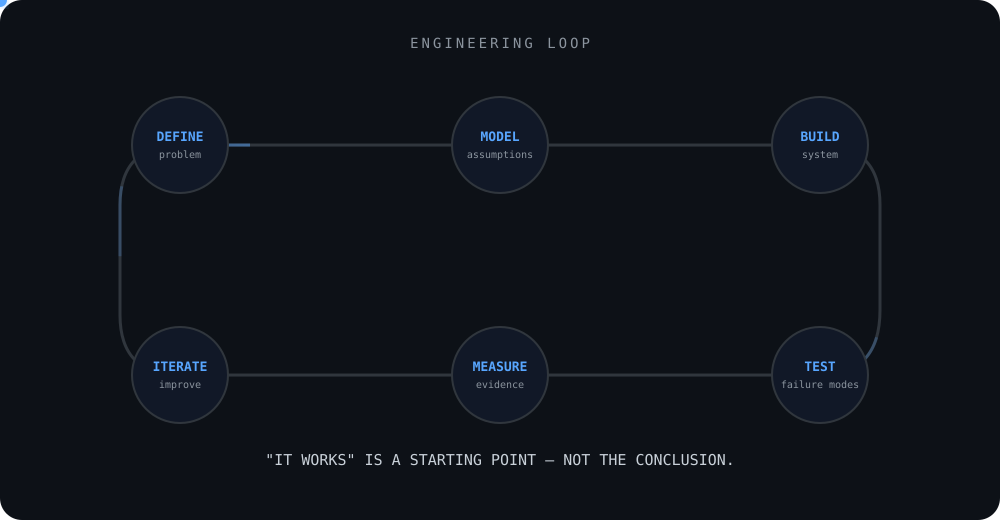
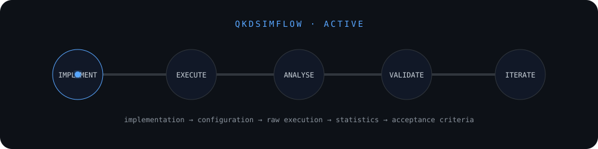
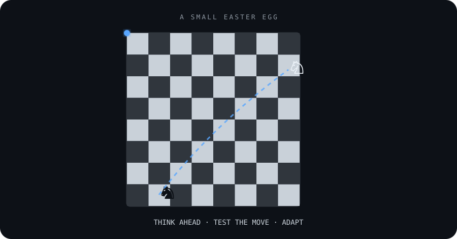
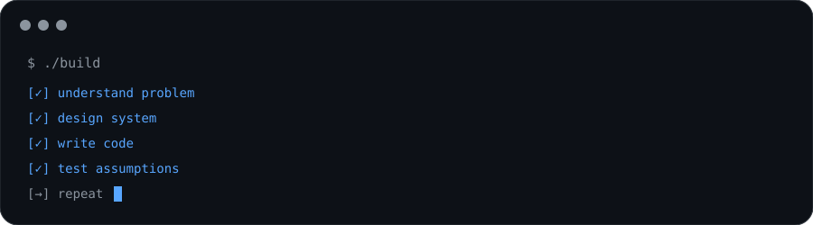

 

---

## `01` · WHAT I BUILD

I work on software where the interesting part is **under the interface** — how data moves, where systems bottleneck, how components fail, and whether the implementation behaves the way the model says it should.

<table>
<tr>
<td width="50%" valign="top">

### ⚛️ QKDSimFlow

**Quantum Key Distribution Simulator**

Interactive BB84 simulation covering channel attenuation, noise, intercept-resend attacks, weak coherent pulses, PNS attacks and decoy-state analysis.

`Python` `FastAPI` `React` `NumPy`

<a href="https://github.com/degarg-ctrl/QKD-Simulator-BB84">↗ explore repository</a>

</td>
<td width="50%" valign="top">

### 🌐 ShieldDNS

**DNS Filtering & Monitoring System**

Custom DNS filtering for UDP/TCP traffic using a 170K+ domain dataset, parent-domain hierarchy matching, non-blocking backend operations and asynchronous logging.

`Node.js` `MongoDB` `DNS` `React Native`

<a href="https://github.com/degarg-ctrl/DNS-Ad-Blocker">↗ explore repository</a>

</td>
</tr>

<tr>
<td width="50%" valign="top">

### ⚡ TaskFlow

**Multi-User Task Management**

Full-stack task management built around authentication, authorization, ownership-protected routes, server-side isolation and persistent sessions.

`React Native` `Node.js` `Express` `MongoDB`

<a href="https://github.com/degarg-ctrl/TaskFlow">↗ explore repository</a>

</td>
<td width="50%" valign="top">

### ◈ PatternBase

**Interview Data & Analytics**

Collection and parsing pipelines that turn unstructured interview logs into categorized, machine-readable datasets and topic-frequency analytics.

`Python` `React` `Node.js` `MongoDB`

</td>
</tr>
</table>

---

## `02` · HOW I ENGINEER

 

<table>
<tr>
<td align="center"><b>01 · DEFINE</b> What is actually being solved?</td>
<td align="center"><b>02 · MODEL</b> What should the system do?</td>
<td align="center"><b>03 · BUILD</b> Turn the model into a system.</td>
</tr>
<tr>
<td align="center"><b>04 · TEST</b> Where does the implementation break?</td>
<td align="center"><b>05 · MEASURE</b> Does reality match expectation?</td>
<td align="center"><b>06 · ITERATE</b> Fix the system, model, or assumption.</td>
</tr>
</table>

> **"It works" is a starting point, not the conclusion.**

I care about making behaviour explainable and testable — especially when a system has constraints, failure modes or assumptions that are easy to hide behind a successful demo.

---

## `03` · UNDER THE HOOD

 

<table>
<tr>
<td width="33%" valign="top">

**BACKEND**

REST APIs  
Authentication & authorization  
Caching  
Database access  
Rate limiting  
RLS / access control

</td>
<td width="33%" valign="top">

**SYSTEMS**

DNS  
UDP / TCP  
Non-blocking I/O  
In-memory lookup  
Concurrency constraints  
Performance measurement

</td>
<td width="33%" valign="top">

**SIMULATION & DATA**

Python / NumPy  
Statistical analysis  
Analytical validation  
Data parsing  
Machine-readable datasets  
Dashboards

</td>
</tr>
</table>

---

## `04` · ENGINEERING SIGNAL

<table>
<tr>
<td align="center" width="25%">

### `170K+`
blocked domains

</td>
<td align="center" width="25%">

### `<50ms`
DNS latency

</td>
<td align="center" width="25%">

### `3,000+`
daily active users

</td>
<td align="center" width="25%">

### `9`
RBAC roles

</td>
</tr>
</table>

Selected figures from systems I've built and worked on — not generic profile statistics.

---

## `05` · CURRENTLY BUILDING

### QKDSimFlow

`IMPLEMENT` → `EXECUTE` → `ANALYSE` → `VALIDATE` → `ITERATE`

The current focus is not just making a quantum key distribution simulator run. It is making the path from **implementation and configuration → raw execution → statistical analysis → acceptance criteria** traceable enough to expose where the model or implementation needs improvement.

---

## `06` · GITHUB ACTIVITY

  

---

## `07` · REPOSITORY SNAPSHOT

 

---

## `08` · ONE MORE THING

### ♟ THINK AHEAD · TEST THE MOVE · ADAPT ♟

A small nod to the other way I like solving problems.

---

  

  

